# VoxelForge Studio

**The Complete AI-Powered Voxel Game Development Platform**

[](https://github.com/wwwbkgme-oss/voxelforge/actions)

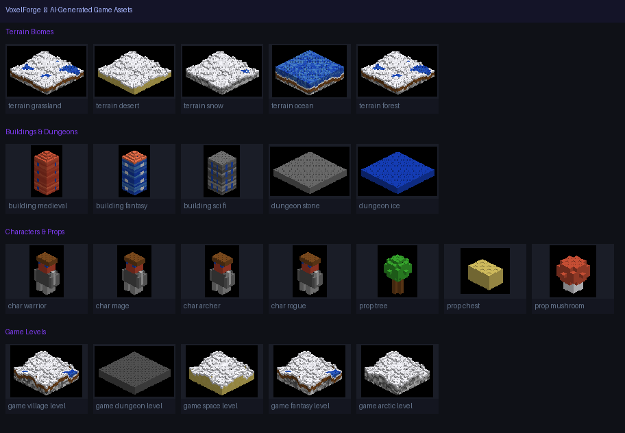

VoxelForge Studio is a full AI game studio — from market validation and GDD to playable voxel worlds — assembled from the best patterns across the open-source AI game dev ecosystem.

---

## What's Inside

| Layer | What It Does |
|-------|-------------|
| **C Voxel Engine** | Rebranded Vopix engine: headless mode, `--screenshot`, SDL2+OpenGL+Lua |
| **AI Sprite Gen** | Text → sprite via OpenRouter/DALL-E; animated spritesheets; chroma-key removal |
| **LLM Narrative Engine** | Dual-model RPG: story LLM + mechanics agent; combat/inventory/social plugins; SQLite state |
| **12-Agent Pipeline** | Market → Design → Build → QA; Go/No-Go decision before a line of code |
| **Procedural Generators** | Terrain (5 biomes), buildings (5 styles), characters (4 classes), props, dungeons (BSP), complete mini-games |
| **Project Manager** | Full lifecycle: init, GDD, milestones, engine configs (VoxelForge/Godot/Unity/Unreal) |
| **REST API + Dashboard** | FastAPI server with 25+ endpoints; zero-dependency web UI at `/ui` |
| **10 AI Tools** | OpenAI function-calling schema for every feature — works with GPT-4o, Claude, Gemini, Ollama |
| **Claude Code Studio** | CLAUDE.md + 6 agents + 9 slash commands + 5 ADRs + GDD templates |

---

## Quick Start

```bash
pip install -e ".[ai]"
voxelforge api            # start server + dashboard at localhost:8080
```

### Generate a complete game in one call

```bash
voxelforge game --title "Crystal Dungeon" --genre dungeon --player-class mage
```

### Run the 12-agent pipeline (market analysis → GDD → build)

```bash
voxelforge pipeline "a voxel dungeon crawler with ice crystals" \
  --genre dungeon --mode development --competitors "Spelunky,Rogue Legacy"
```

### Generate AI sprites (with OpenRouter key) or procedural fallback

```bash
export OPENROUTER_API_KEY=sk-or-v1-...   # optional
voxelforge ai-sprite "pixel art ice mage, isometric" --name ice_mage
```

### Play an LLM narrative game in your terminal

```bash
export OPENAI_API_KEY=sk-...   # optional — works without key too
voxelforge narrative --player "Zara" --genre dungeon
```

### Initialize a full project with engine structure

```bash
voxelforge project init "Crystal Dungeon" \
  "A voxel dungeon crawler with AI-generated ice caves" \
  --engine voxelforge --mode development
```

---

## Architecture

```
voxelforge/
├── engine/                    # C game engine (VoxelForge — headless + screenshot modes)
│
├── forge/                     # Python platform layer
│   ├── voxel.py               # VoxelModel, Palette — .vox binary I/O
│   ├── scene.py               # Scene builder (exact C engine JSON format)
│   ├── imagegen.py            # AI sprite gen: OpenRouter/DALL-E/procedural fallback
│   │                          #   → SpriteGenerator, AnimationResult, chromo-key removal
│   ├── narrative.py           # LLM narrative engine (ackness/ai-gamestudio pattern)
│   │                          #   → dual-model, 5 plugins, SQLite state, memory compression
│   ├── pipeline.py            # 12-agent pipeline (pamirtuna/gamestudio-subagents pattern)
│   │                          #   → market analysis, GDD, milestones, QA, Go/No-Go
│   ├── project.py             # Project lifecycle manager
│   │                          #   → VoxelForge/Godot/Unity/Unreal structures, agent config
│   ├── studio.py              # Design tools: GDD, brainstorm, MDA, ADR, lore
│   ├── generators/
│   │   ├── terrain.py         # FBM noise terrain, 5 biomes
│   │   ├── buildings.py       # 5 architectural styles
│   │   ├── characters.py      # 4 character classes
│   │   ├── props.py           # 7 prop types
│   │   ├── dungeon.py         # BSP dungeon, 4 styles
│   │   └── game.py            # Complete mini-game generator
│   ├── export/
│   │   └── sprite_renderer.py # Software isometric renderer → PNG (no engine needed)
│   ├── api/
│   │   ├── server.py          # FastAPI, 25+ endpoints
│   │   ├── models.py          # Pydantic schemas
│   │   └── static/index.html  # Web dashboard (zero dependencies)
│   └── ai/
│       ├── tools.py           # 10 OpenAI function-calling tools
│       └── agent.py           # Autonomous game-creation agent
│
├── cli/main.py                # 19 CLI commands
├── tests/test_voxel.py        # 29 pytest tests
├── design/                    # ADRs, GDDs, sprint plans
├── docs/demo/                 # 31 AI-generated demo sprites + banner
└── .claude/                   # CLAUDE.md, 6 agents, 9 skills, rules, templates
```

---

## All 25+ API Endpoints

### Assets
| `POST /asset/terrain` | `POST /asset/building` | `POST /asset/character` |
| `POST /asset/prop` | `POST /asset/dungeon` | `GET /assets` |

### Sprites (acatovic/ai-game-studio)
| `POST /sprite/generate` | `POST /sprite/batch` | `POST /sprite/remove-bg` |

### Scenes & Worlds
| `POST /scene/build` | `GET /scenes` | `POST /world/build` |

### Complete Games
| `POST /game/generate` |

### Narrative Engine (ackness/ai-gamestudio)
| `POST /narrative/session` | `POST /narrative/chat` | `GET /narrative/sessions` |
| `GET /narrative/status/{id}` |

### 12-Agent Pipeline (pamirtuna/gamestudio-subagents)
| `POST /pipeline/run` |

### Project Management
| `POST /project/init` | `GET /project/list` | `GET /project/{slug}` |

### Agent
| `POST /agent/run` |

Full interactive docs: **http://localhost:8080/docs**
Web dashboard: **http://localhost:8080/ui**

---

## AI Sprite Generation

Inspired by **[acatovic/ai-game-studio](https://github.com/acatovic/ai-game-studio)**:

```python
from forge.imagegen import SpriteGenerator

gen = SpriteGenerator()   # uses OPENROUTER_API_KEY or OPENAI_API_KEY if set

# Single sprite with chroma-key BG removal
result = gen.generate("pixel art ice mage, isometric view", name="mage")
print(result.image_path, result.model_used)   # works without API key (procedural)

# Animated spritesheet (requires ffmpeg + OpenRouter key)
anim = gen.generate_animated("warrior idle breathing animation", name="warrior_idle")
print(anim.spritesheet, anim.gif_path)

# Batch generation
results = gen.generate_batch(
    prompts=["oak tree", "stone chest", "barrel"],
    names  =["tree",     "chest",       "barrel"],
)
```

**Flow (exact acatovic pattern):**
1. Prompt → OpenRouter image model (chroma-green #00b140 background directive)
2. Image → OpenRouter video model (Grok Imagine Video / Seedance 2.0)
3. ffmpeg extracts frames → chroma-key removal via Pillow
4. Frames → 1×N PNG spritesheet + looping GIF

**Fallback:** Procedural pixel-art generator (no API key needed, always works)

---

## LLM Narrative Engine

Inspired by **[ackness/ai-gamestudio](https://github.com/ackness/ai-gamestudio)**:

```python
from forge.narrative import NarrativeEngine

engine  = NarrativeEngine(llm_model="gpt-4o-mini")  # or any OpenAI-compatible endpoint
session = engine.start_session(player_name="Zara", genre="dungeon",
                                world_text="An ancient ice dungeon...")

response = engine.send_message(session.id, "I look around the room")
print(response.text())     # narrative prose
print(response.choices())  # suggested actions
```

**Architecture:**
- **Primary LLM** — generates narrative prose as structured JSON blocks
- **Plugin Agent** — 5 mechanics plugins: `combat`, `inventory`, `social`, `memory`, `guide`
- **SQLite** — persistent game state (HP, score, inventory, relationships, event log)
- **Memory Compression** — auto-compresses long sessions (MemoryPlugin)
- **Block types** — `narrative`, `dialogue`, `choices`, `combat`, `item`, `image`, `game_over`
- **LiteLLM-compatible** — works with any OpenAI-compatible provider

**Terminal gameplay:** `voxelforge narrative --player "Hero" --genre dungeon`

---

## 12-Agent Pipeline

Inspired by **[pamirtuna/gamestudio-subagents](https://github.com/pamirtuna/gamestudio-subagents)**:

```python
from forge.pipeline import GamePipeline

pipeline = GamePipeline()
result   = pipeline.run(
    concept     = "A voxel dungeon crawler where players collect ice crystals",
    genre       = "dungeon",
    mode        = "development",   # design | prototype | development
    competitors = ["Spelunky", "Rogue Legacy"],
    build_game  = True,
)
print(result.market.recommendation)    # GO | NO-GO | PIVOT
print(result.market.opportunity_score) # 0–10
print(result.design.gdd_path)          # generated GDD
print(result.build.run_command)        # engine run command
```

**12 Agents:**
- **Directors**: Master Orchestrator, Producer
- **Intelligence**: Market Analyst, Data Scientist
- **Design**: Sr Game Designer, Mid Game Designer
- **Engineering**: Mechanics Developer, Game Feel Developer
- **Art**: Sr Game Artist, Technical Artist
- **Interface**: UI/UX Agent
- **Quality**: QA Agent

**4 Phases:** Market Validation → Design (GDD + milestones) → Build → QA

---

## Project Manager

Inspired by **[pamirtuna/gamestudio-subagents](https://github.com/pamirtuna/gamestudio-subagents)** init_project.py:

```python
from forge.project import ProjectManager

pm   = ProjectManager("projects")
proj = pm.init_project(
    name        = "Crystal Dungeon",
    concept     = "A voxel dungeon crawler with AI-generated ice caves",
    genre       = "dungeon",
    engine      = "voxelforge",   # or: godot | unity | unreal
    mode        = "development",
    competitors = ["Spelunky", "Rogue Legacy"],
)
print(proj.status_summary())
print(proj.next_milestone())
```

Creates full project structure:
- Documentation (GDD, ADRs, milestones, retrospectives, market research)
- Engine-specific source layout (VoxelForge/Godot/Unity/Unreal)
- CLAUDE.md with agent configuration
- Competitor analysis scaffolding
- `.gitignore`, README, timeline

---

## All 19 CLI Commands

```bash
# Asset generation
voxelforge generate terrain/building/character/prop
voxelforge game --title "..." --genre dungeon

# World building
voxelforge world --name world --biome grassland
voxelforge agent "a medieval village with 3 buildings"

# AI sprites (NEW — acatovic pattern)
voxelforge ai-sprite "pixel art warrior" --name warrior
voxelforge ai-sprite "warrior walk cycle" --animated --frames 8

# Narrative game (NEW — ackness pattern)
voxelforge narrative --player "Hero" --genre dungeon

# 12-agent pipeline (NEW — pamirtuna pattern)
voxelforge pipeline "dungeon crawler concept" --mode design --build

# Project lifecycle (NEW — pamirtuna pattern)
voxelforge project init "My Game" "concept" --engine godot
voxelforge project list
voxelforge project status my-game

# Design studio
voxelforge gdd "My Game" --genre dungeon --preview
voxelforge brainstorm "zombie survival" --preview
voxelforge mda manifest.json
voxelforge adr "use REST API for all generation"
voxelforge lore "Crystal Keep" --genre dungeon

# Rendering
voxelforge sprite --input model.vox --output preview.png
voxelforge sprite --all   # thumbnails for all assets

# Server
voxelforge api             # starts server + dashboard
```

---

## Demo — AI-Generated Assets

All images below are **100% procedurally generated** (no manual art).

### Terrain Biomes
| Grassland | Desert | Snow | Ocean | Forest |
|-----------|--------|------|-------|--------|
| 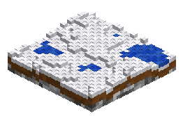 | 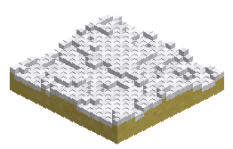 | 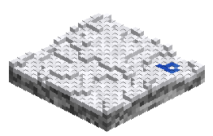 | 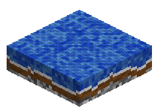 | 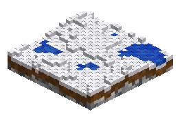 |

### Buildings (5 Styles)
| Medieval | Modern | Sci-Fi | Rustic | Fantasy |
|----------|--------|--------|--------|---------|
| 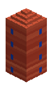 | 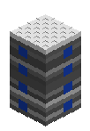 | 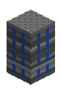 | 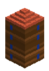 | 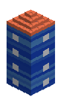 |

### Characters & Props
| Warrior | Mage | Archer | Rogue | Tree | Chest | Mushroom |
|---------|------|--------|-------|------|-------|---------|
|  |  | 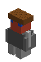 |  | 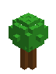 | 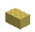 |  |

### BSP Dungeons
| Stone | Dungeon | Cave | Ice |
|-------|---------|------|-----|
| 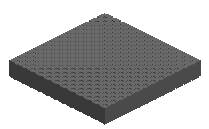 |  | 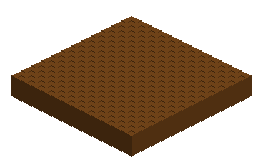 | 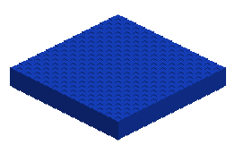 |

### Complete Game Levels
| Village | Dungeon | Space | Fantasy | Arctic |
|---------|---------|-------|---------|--------|
| 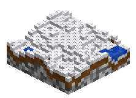 |  | 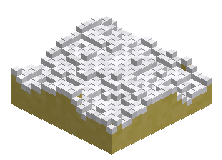 | 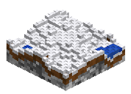 | 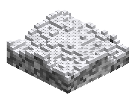 |

---

## Sources & Credits

| Repo | Pattern Used |
|------|-------------|
| [KellerMartins/PixelVoxels](https://github.com/KellerMartins/PixelVoxels) | C voxel engine (rebranded + headless mode) |
| [acatovic/ai-game-studio](https://github.com/acatovic/ai-game-studio) | AI sprite + animation generation via OpenRouter |
| [ackness/ai-gamestudio](https://github.com/ackness/ai-gamestudio) | LLM narrative engine, plugin system, SQLite state |
| [pamirtuna/gamestudio-subagents](https://github.com/pamirtuna/gamestudio-subagents) | 12-agent pipeline, market analysis, project init |
| [Yuan-ManX/ai-game-devtools](https://github.com/Yuan-ManX/ai-game-devtools) | AI tool catalog, world model references |
| [Donchitos/Claude-Code-Game-Studios](https://github.com/Donchitos/Claude-Code-Game-Studios) | Agent roles, slash commands, MDA framework |

---

## Environment Variables

```bash
# Image generation (acatovic pattern)
OPENROUTER_API_KEY=sk-or-v1-...     # 300+ models via openrouter.ai
OPENAI_API_KEY=sk-...               # DALL-E fallback

# Narrative engine + pipeline (ackness/pamirtuna pattern)
LLM_API_KEY=sk-...                  # Any OpenAI-compatible key
LLM_MODEL=gpt-4o-mini               # Model name
LLM_API_BASE=https://api.openai.com/v1   # Custom endpoint (Ollama, OpenRouter, etc.)

# Assets
VOXELFORGE_ASSETS_DIR=generated_assets  # Where all outputs are saved
```

All features work without any API keys — procedural fallbacks are always available.

---

## Tests

```bash
pytest tests/ -v    # 29 tests: voxel I/O, generators, scene format, studio tools
```

---

## License

MIT — original Vopix engine by [KellerMartins](https://github.com/KellerMartins/PixelVoxels). All VoxelForge additions MIT.
